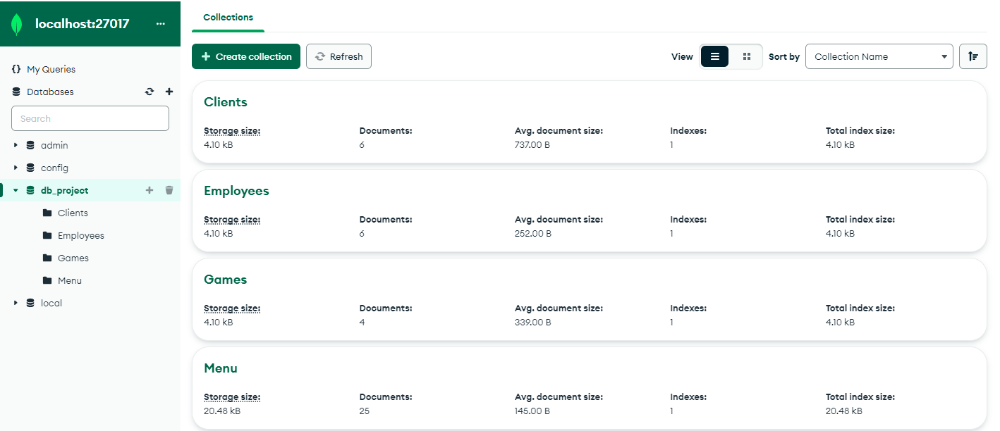
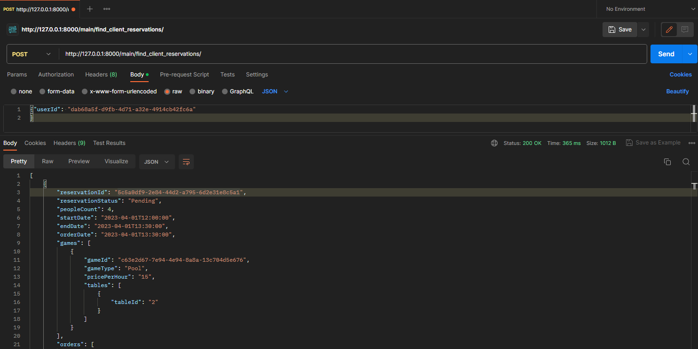

# Dokumentacja
Celem projektu było zrealizowanie aplikacji umożliwiającej dokonywanie rezerwacji oraz zarządzanie salonem gier z funkcjonalnościami pubu.

## Schemat bazy danych
---
Na bazę składają się 4 kolekcje.

- Clients
  ``` json 
  {
    "userId": 1,
    "firstName": "Jan",
    "lastName": "Kowalski",
    "dateOfBirth": "1990-01-01",
    "email": "jan.kowalski@example.com",
    "phone": "123456789",
    "address": "ul. Przykładowa 1, 00-001 Warszawa",
    "registerDate": "2024-01-01",
    "reservations": [
      {
        "reservationId": 1,
        "reservationStatus": "confirmed",
        "peopleCount": 4,
        "startDate": "2024-01-02",
        "endDate": "2024-01-03",
        "games": [
          {
            "gameId": 1,
            "gameType": "Pool",
            "capacity": 4,
            "pricePerHour": "10.00",
            "tables": [
              {
                "tableId": 1,
                "capacity": 2
              }
            ]
          }
        ],
        "orders": [
          {
            "orderId": 1,
            "dishes": [1, 2, 3],
            "orderDate": "2024-01-02",
            "finalPrice": "25.00"
          }
        ]
      }
    ]
  }
  ```
  Informacje o klientach lokalu. Praktycznie wszystkie dane osobowe, data rejestracji oraz rezerwacje składane przez tego klienta.
- Games
  ``` json
  {
    "_id": {
      "$oid": "648c4fe533baa7342d60cfab"
    },
    "gameId": "a831e76b-5f4f-4a36-bdbd-9ffbc47d9732",
    "gameType": "Bowling",
    "capacity": 20,
    "pricePerHour": "20",
    "tables": [
      {
        "tableId": "1",
        "capacity": 5,
        "reservedDates": [
          {
            "startDate": {
              "$date": "2023-02-01T17:00:00Z"
            },
            "endDate": {
              "$date": "2023-02-01T20:00:00Z"
            }
          }
        ]
      },
      {
        "tableId": "2",
        "capacity": 5
      },
      {
        "tableId": "3",
        "capacity": 5
      },
      {
        "tableId": "4",
        "capacity": 5
      }
    ]
  }
  ```
  Informacje o grach oferowanych przez pub. Wyróżniamy typ gry, maksymalną ilość osób, cenę za godzinę oraz stoliki przypisane do gry wraz z zarezerwowanymi datami.

- Employees
  ``` json
  {
    "_id": {
      "$oid": "648c511b33baa7342d60cfb6"
    },
    "employeeId": "2b57c003-5e4a-478b-a14a-b5c03a8f72ff",
    "employeeType": "Waiter",
    "firstName": "Bob",
    "lastName": "Johnson",
    "dateOfBirth": "1987-02-02",
    "email": "bob.johnson@example.com",
    "phone": "4444444444",
    "registerDate": "2023-01-01"
  }
  ```
  Informacje o pracowniku, pozycja, imię i nazwisko, rok urodzenia, mail, telefon oraz data zarejestrowania.

- Menu 
  ``` json
  {
  "_id": {
    "$oid": "648c508933baa7342d60cfaf"
  },
  "dishId": "8b231755-8c29-4e3d-94c5-67c8c56b049c",
  "dishType": "Appetizer",
  "description": "Chicken Wings",
  "dishPrice": "10"
  }
  ```
  Przykładowy wygląd pozycji w Menu. Informacje o typie dania, nazwie oraz cenie.

## Wygląd kolekcji w narzędziu MongoDB Compass:




## Frontend
---
Frontend został zrealizowany przy wykorzystaniu frameworka Angular. <br>

Frontend oraz backend komunikują się ze sobą za pomocą serwisu `making-reservation-service`. Znajdują się w nim poniższe funkcje.
- Funkcja do pozyskiwania listy dań:
```Typescript
getDishList(): Observable<any[]> {
    return this.http.get<any[]>(this.baseUrl + '/find_all_dishes/');
  }
```

- Funkcja do pozyskiwania listy dań:
```Typescript
getDishList(): Observable<any[]> {
    return this.http.get<any[]>(this.baseUrl + '/find_all_dishes/');
  }
```

- Funkcja do pozyskiwania listy gier:
```Typescript
getGamesList(): Observable<any[]> {
    return this.http.get<any[]>(this.baseUrl + '/find_all_games/');
  }
```
- Funkcja do pozyskiwania dań przypisanych do rezerwacji:
```Typescript
getReservationDishes(email: string, reservationId: string) {
    return this.http.post<any[]>(this.baseUrl + '/find_reservation_by_param/', {
      email,
      reservationId,
    });
  }
```

- Funkcja do pozyskiwania rezerwacji za pomocą maila:
```Typescript
getReservationsByEmail(email: string): Observable<any[]> {
    return this.http.post<any[]>(this.baseUrl + '/find_reservation_by_param/', {
      email,
    });
  }
```

- Funkcja do aktualizacji statusu rezerwacji:
```Typescript
updateReservationStatus(
    email: string,
    id: string,
    status: string
  ): Observable<any> {
    return this.http.post<any>(`${this.baseUrl}/update_reservation/`, {
      email: email,
      reservationId: id,
      reservationStatus: status,
    });
  }
```

- Funkcja do aktualizacji dań przypisanych do rezerwacji:
```Typescript
updateReservationDishes(
    email: string,
    reservationId: string,
    reservationDishList: string[]
  ) {
    return this.http.post<any>(`${this.baseUrl}/update_reservation/`, {
      email: email,
      reservationId: reservationId,
      dishes: reservationDishList,
    });
  }
```

- Funkcja uzyskująca stoliki przypisane grze:
```Typescript
getTablesForGame(gameId: string): Observable<any[]> {
    const headers = new HttpHeaders({ 'Content-Type': 'application/json' });
    const params = new HttpParams().set('gameId', gameId);
    return this.http.get<any[]>(this.baseUrl + '/display_tables_for_game/', {
      headers,
      params,
    });
  }
```

- Funkcja sprawdzająca czy data jest dostępna:
```Typescript
checkIfFreeDate(gameId: string, startDate: string, endDate: string) {
    const headers = new HttpHeaders({ 'Content-Type': 'application/json' });
    let params = { gameId, startDate, endDate };
    return this.http.get<any[]>(this.baseUrl + '/check_if_free_date/', {
      headers,
      params,
    });
  }
```

## Backend
---
Backend realizowany był przy wykorzystaniu Pythonowego frameworka Django. <br>
Przykładowe zapytania do bazy:

- wyszukiwanie klienta, gry, dania lub pracownika o danym id:
``` Python
@csrf_exempt
def find_game(request):
    if request.method == 'POST':
        data = json.loads(request.body)
        mongo_db = MongoDB()
        game_doc = mongo_db.find_one('Games', {'gameId': data['gameId']})

        if game_doc:
            game = Game(game_doc)
            return JsonResponse(game.__dict__)
        else:
            return JsonResponse({"error": "Game not found"}, status=404)
    else:
        return JsonResponse({"error": "Invalid method"}, status=405)
```
- usuwanie klienta, dania, gry lub pracownika o danym id:
``` Python
@csrf_exempt
def delete_game(request):
    if request.method == 'POST':
        data = json.loads(request.body)
        mongo_db = MongoDB()
        result = mongo_db.delete_one('Games', {'gameId': data['gameId']})
        return JsonResponse({"deleted_count": result.deleted_count})
    else:
        return JsonResponse({"error": "Invalid method"})
```

- aktualizowanie danych na temat danego klienta, gry, dania lub pracownika:
``` Python  
@csrf_exempt
def update_game(request):
    if request.method == 'POST':
        data = json.loads(request.body)
        mongo_db = MongoDB()
        game_id = data.pop('gameId')
        result = mongo_db.update_one('Games', {'gameId': game_id}, data)
        return JsonResponse({"modified_count": result.modified_count})
    else:
        return JsonResponse({"error": "Invalid method"})
```

- uzyskiwanie wszystkich dań, gier, klientów lub pracowników:
``` Python
@csrf_exempt
def find_all_games(request):
    if request.method == 'GET':
        mongo_db = MongoDB()
        games = mongo_db.find_all('Games')
        return JsonResponse({"games": json.loads(dumps(games))})
    else:
        return JsonResponse({"error": "Invalid method"})
```
Powyższe zapytania w pozostałych przypadkach wyglądają analogicznie i działają w ten sam sposób dla odpowiednich kolekcji. <br>

### Bardziej rozbudowane funkcje:

- tworzenie rezerwacji:
``` Python
@csrf_exempt
def create_reservation(request):
    if request.method == 'POST':
        data = json.loads(request.body)

        # create a new MongoDB connection
        mongo_db = MongoDB()

        # retrieve the client and game using their respective IDs
        client = mongo_db.find_one('Clients', {'email': data['email']})
        game = mongo_db.find_one('Games', {'gameId': data['gameId']})

        if client is None or game is None:
            return JsonResponse({"error": "Client or game not found"})

        # convert string dates into datetime objects
        start_date = datetime.strptime(data['startDate'], '%Y-%m-%dT%H:%M:%S.%f%z')
        end_date = datetime.strptime(data['endDate'], '%Y-%m-%dT%H:%M:%S.%f%z')
        order_date = datetime.now()
        final_price, dish_list = get_price_and_dishes(data['dishes'], mongo_db)

        # create a minimal game object with only required fields
        minimal_game = {
            'gameId': game['gameId'],
            'gameType': game['gameType'],
            'pricePerHour': game['pricePerHour'],
            'tables': [{'tableId': table['tableId']} for table in game['tables'] if table['tableId'] in data['tables']]
        }

        # create a new reservation
        reservation = Reservation(reservationId=str(uuid.uuid4()), reservationStatus='Pending',
                                  peopleCount=data['peopleCount'], startDate=start_date, endDate=end_date,
                                  orderDate=order_date, games=[minimal_game], orders=[
                {'orderId': str(uuid.uuid4()), 'dishes': dish_list, 'finalPrice': final_price}])

        reservation_dict = reservation.__dict__

        # add the new reservation to the client's reservations
        client['reservations'].append(reservation_dict)
        mongo_db.update_one('Clients', {'email': data['email']}, {'reservations': client['reservations']})

        # add the new reservation to the game's tables
        for table in game['tables']:
            if table['tableId'] in data['tables']:
                table['reservedDates'].append({'startDate': start_date, 'endDate': end_date})
                mongo_db.update_one('Games', {'gameId': data['gameId']}, {'tables': game['tables']})

        return JsonResponse({'status': 'success'}, status=200)
    else:
        return JsonResponse({"error": "Invalid method"})
```
- obliczanie rachunku za zamówienie:
```Python
@csrf_exempt
def calculate_recipe(request):
    if request.method == 'POST':
        mongo_db = MongoDB()
        data = json.loads(request.body)
        user_Id = data.pop('userId')
        reservations = mongo_db.find_one('Clients', {'userId': user_Id})['reservations']
        if reservations == []:
            return JsonResponse({"error": "Client has no reservations."})
        startDate = reservations[0]['startDate']
        endDate = reservations[0]['endDate']
        time = endDate - startDate
        hours = time.total_seconds() / 3600
        total_price = 0
        for game in reservations[0]['games']:
            total_price += float(game['pricePerHour']) * hours
        total_price += float(reservations[0]['orders'][0]['finalPrice'])
        return JsonResponse({"total_price": json.loads(dumps(total_price))})
    else:
        return JsonResponse({"error": "Invalid method"})
```
- wyszukiwanie konkretnej rezerwacji:
```Python
@csrf_exempt
def find_reservation_by_param(request):
    if request.method == 'POST':
        data = json.loads(request.body)
        mongo_db = MongoDB()

        search_param = {}
        if 'userId' in data:
            search_param = {'userId': data['userId']}
        elif 'email' in data:
            search_param = {'email': data['email']}

        if not search_param:
            return JsonResponse({"error": "Missing search parameter (userId or email)"}, status=400)

        client_doc = mongo_db.find_one('Clients', search_param)

        if client_doc:
            reservations = client_doc.get('reservations', [])
            if data.get('reservationId'):
                reservations = [reservation for reservation in reservations if
                                    reservation['reservationId'] == data.get('reservationId')]
            reservations = json.dumps(reservations, cls=JSONEncoder)
            return HttpResponse(reservations, content_type='application/json')
        else:
            return JsonResponse({"error": "Client not found"}, status=404)
    else:
        return JsonResponse({"error": "Invalid method"}, status=405)
```


## Testowanie 
---
Do testowania wykorzystaliśmy platformę Postman.


